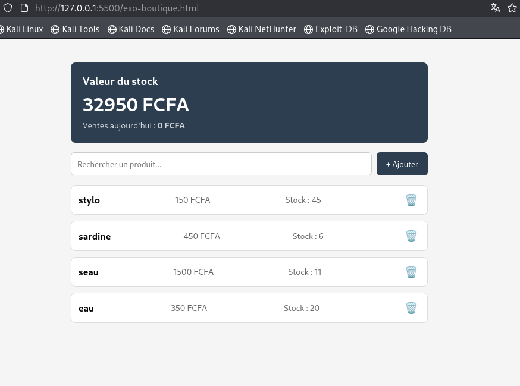
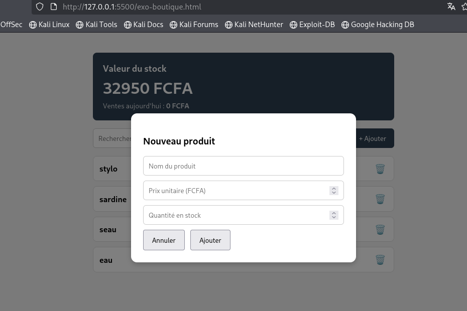
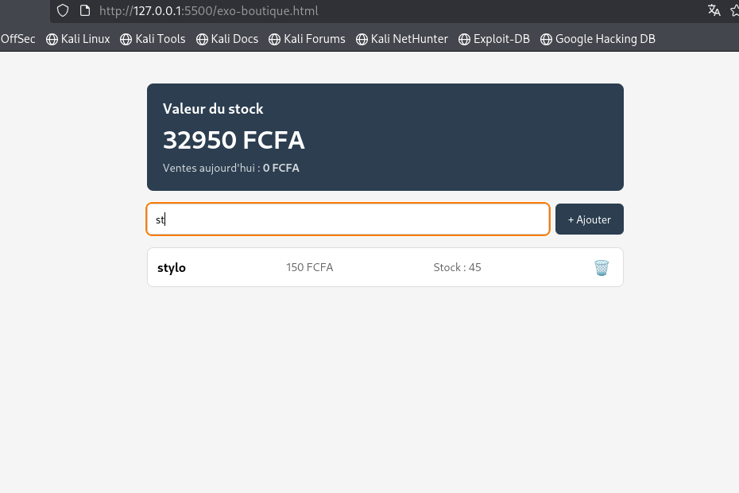
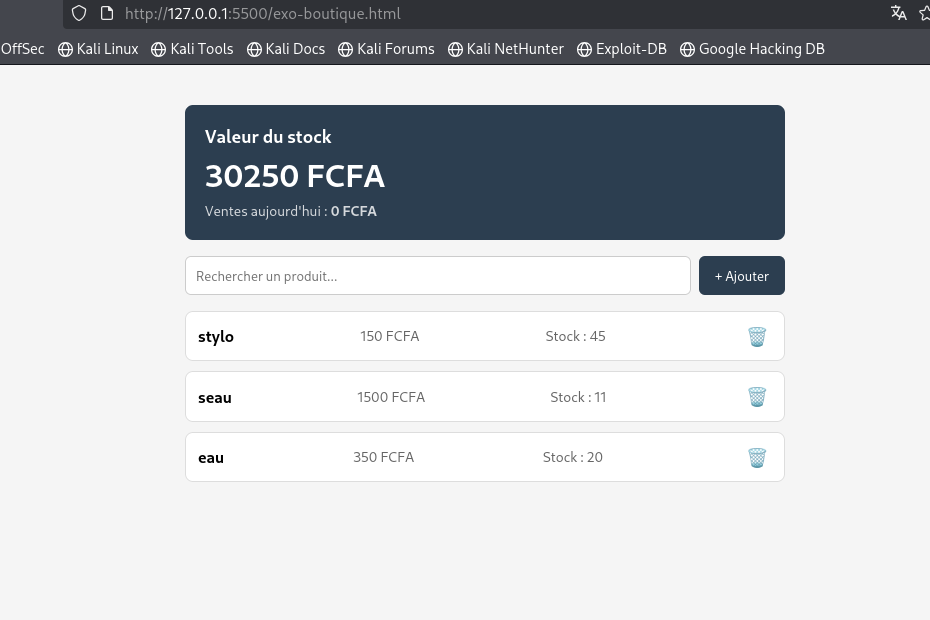

# 🛒 Boutique CRUD JS

Une application web simple de gestion de stock développée en **HTML, CSS et JavaScript Vanilla**. Les données sont enregistrées localement grâce au **LocalStorage**, ce qui permet d'utiliser l'application sans connexion Internet.

## Aperçu

Ce projet a été réalisé dans le cadre de mon apprentissage du développement JavaScript. L'objectif était de comprendre le fonctionnement d'un CRUD (Create, Read, Update, Delete) en manipulant directement le DOM et en stockant les données dans le navigateur.

L'application est actuellement développée dans un seul fichier `index.html`, qui contient le HTML, le CSS et le JavaScript.

## Fonctionnalités

* Ajouter un produit
* Afficher la liste des produits
* Rechercher un produit par son nom
* Supprimer un produit
* Calcul automatique de la valeur totale du stock
* Sauvegarde automatique des données avec LocalStorage
* Interface simple et responsive

## Technologies utilisées

* HTML5
* CSS3
* JavaScript (Vanilla)
* LocalStorage

## Structure du projet

```text
boutique-crud-js/
│
├── index.html
└── README.md
```

## Lancer le projet

1. Télécharger ou cloner le dépôt.
2. Ouvrir le fichier `index.html` dans un navigateur web.
3. Aucun serveur ou framework n'est nécessaire.

## Captures d'écran
### Accueil



### Ajout d'un produit



### Recherche



### Suppression



## Ce que j'ai appris

Grâce à ce projet, j'ai appris à :

* manipuler le DOM ;
* créer et gérer des formulaires ;
* utiliser les événements JavaScript ;
* manipuler les tableaux et les objets ;
* créer un CRUD avec JavaScript ;
* enregistrer des données avec LocalStorage ;
* effectuer une recherche dynamique ;
* calculer des statistiques simples à partir des données.

## Améliorations prévues

Les prochaines versions du projet incluront :

* Modification d'un produit
* Gestion des quantités avec boutons + et -
* Ajout d'images pour les produits
* Historique des ventes
* Tableau de bord avec statistiques
* Génération de factures
* Migration du stockage LocalStorage vers SQLite
* Version Android fonctionnant hors ligne

## Auteur

Développé par **FASSEU DEKEN PRINCE MARCEL**, étudiant en première année du cycle ingénieur à l'École Polytechnique de Douala.

Je publie ce projet afin de suivre ma progression en développement web et de construire un portfolio composé de projets concrets et évolutifs.

## Licence

Ce projet est distribué sous la licence MIT. Vous êtes libre de l'utiliser, de le modifier et de l'améliorer en conservant la mention de l'auteur d'origine.

